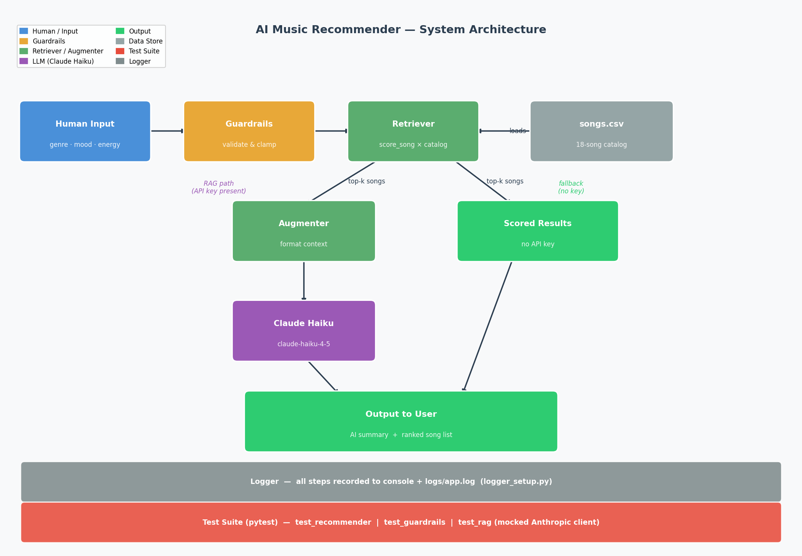

# VibeFinder — AI Music Recommender

> A production-style music recommender that listens to how you feel, reads your recent listening history, and pulls real Spotify songs that match your current vibe — powered by a RAG pipeline, a free Groq LLM, and SpotAPI for live song data. Built as a capstone evolution of a Module 1–3 simulation project.

**Video Walkthrough:** [Add Loom link here after recording]
**GitHub:** https://github.com/Oseipokuamoafo/final-project-cap

---

## Origin Project

**Music Recommender Simulation** (Modules 1–3, `ai110-module3show-musicrecommendersimulation-starter`)

The original project built a content-based music recommender that scored songs against a user's explicit taste profile — genre, mood, energy level, and acoustic preference — and returned a ranked list of results with plain-language explanations for every score. Its goal was to simulate the logic behind real streaming platform recommendations using a simple, fully transparent scoring algorithm, so the reasoning behind each suggestion could always be traced back to specific song features. It ran as a CLI tool over an 18-song CSV catalog and included a basic test suite covering ranking correctness and explanation formatting.

---

## What This Project Does and Why It Matters

This capstone takes that simulation and upgrades it into a **full AI-powered application** with five meaningful additions:

1. **Mood-aware discovery** — users describe how they feel in plain English ("stressed, need to decompress") or paste songs they've been listening to, and a Groq LLM extracts structured music preferences automatically. No sliders required.
2. **Live Spotify data** — instead of an 18-song CSV, the system fetches real tracks from Spotify via SpotAPI (no API key, no result limits) for whatever genre the user's mood maps to.
3. **RAG pipeline** — retrieved songs are passed as structured context to a free Groq LLM (llama-3.1-8b-instant), which generates a natural-language summary explaining why the top picks fit the user's profile. The LLM never guesses blindly; it only comments on songs that were mathematically ranked first.
4. **Input guardrails** — all preferences are validated before scoring: energy is clamped to `[0.0, 1.0]`, unknown genres and moods produce logged warnings, and type errors surface as clear messages.
5. **Structured logging** — every step from mood parsing through LLM generation is recorded to both the console and a log file, making the system auditable.

This matters because it demonstrates a pattern that appears in nearly every real production AI system: **retrieve first, then generate**. The LLM is not doing the ranking — the deterministic scoring engine is. The LLM is doing what it is actually good at: synthesizing structured data into readable, human-friendly prose. Keeping those responsibilities separate makes the system more reliable, more testable, and easier to explain.

---

## System Architecture



The system has five main components:

| Component | File | Role |
|---|---|---|
| **Human Input** | `src/app.py` (Streamlit) or `src/main.py` (CLI) | Accepts genre, mood, energy, acoustic preference |
| **Guardrails** | `src/guardrails.py` | Validates and sanitizes all input before processing |
| **Retriever** | `src/recommender.py` | Scores every song in the catalog; returns top-k ranked results |
| **Augmenter + LLM** | `src/rag_recommender.py` | Formats retrieved songs as context; calls Claude Haiku to generate a summary |
| **Logger** | `src/logger_setup.py` | Records all steps to console and `logs/app.log` |

**Data flow:**

```
Human Input → Guardrails → Retriever ← songs.csv
                               │
              ┌────────────────┴─────────────────┐
              │ (API key present)                  │ (no key)
           Augmenter → Claude Haiku           Scored List
              │                                    │
              └────────────────┬───────────────────┘
                         Output to User
                    (AI summary + ranked list)
```

The test suite sits outside the runtime loop and verifies each component independently using a mocked Anthropic client — so tests never require a live API key or network access.

---

## Setup Instructions

### Prerequisites

- Python 3.11 or higher
- A free [Groq API key](https://console.groq.com) *(recommended — enables mood parsing + AI summaries, no credit card)*
- An [Anthropic API key](https://console.anthropic.com) *(alternative to Groq — paid)*
- No Spotify credentials needed — live song data is fetched via SpotAPI

### 1. Clone the repository

```bash
git clone https://github.com/Oseipokuamoafo/final-project-cap.git
cd final-project-cap
```

### 2. Create and activate a virtual environment

```bash
python3 -m venv .venv
source .venv/bin/activate        # Mac / Linux
.venv\Scripts\activate           # Windows
```

### 3. Install dependencies

```bash
pip install -r requirements.txt
```

### 4. Configure your API key *(optional)*

```bash
cp .env.example .env
# Open .env and set ANTHROPIC_API_KEY=sk-ant-...
```

### 5. Run the application

**Streamlit UI (recommended):**
```bash
streamlit run src/app.py
```

**CLI — scored-only mode:**
```bash
python3 -m src.main
```

**CLI — with AI-generated summaries:**
```bash
ANTHROPIC_API_KEY=sk-ant-... python3 -m src.main --rag
```

### 6. Run the test suite

```bash
python3 -m pytest tests/ -v
```

Expected output: **17 tests, all passing**, in under 1 second.

---

## Sample Interactions

### Example 1 — Mood from plain English (Streamlit, Mode 1)

**Input (typed into the mood box):**
> "I've been stressed from school all week and just want something calm to decompress tonight"

**Groq inference:**
```
Vibe detected: Relaxed · Lofi · 20% energy · Acoustic preferred
Reasoning: User needs calming, low-energy music with warm acoustic texture to unwind.
```

**AI Summary (Groq):**
> Your top pick is **Lo-Fi Chill** — it matches every preference: lofi genre, relaxed mood, gentle energy at 0.32, and strong acousticness. Right behind it is **Distant Lover** by Marvin Gaye — a classic that crosses into soul territory but carries the same low-energy, warm acoustic feel your profile is calling for. Every track in your top 5 stays below 0.4 energy, which shows the system has a clear read on what you need tonight.

---

### Example 2 — Mood guessed from recent songs (Streamlit, Mode 2)

**Input (pasted into "recent songs" box):**
```
Radiohead - Karma Police
Portishead - Glory Box
Bon Iver - Skinny Love
The National - Bloodbuzz Ohio
```

**Groq inference:**
```
Vibe detected: Moody · Indie Pop · 40% energy · Acoustic preferred
Reasoning: These artists share introspective, cinematic emotional character
           with medium-low energy and a preference for acoustic texture.
```

**Top Spotify songs returned:** Real tracks scored by genre/mood/energy match — indie and alternative artists aligned with the inferred profile.

---

### Example 3 — Guardrail triggered (energy out of range)

**Input:**
```
genre=rock, mood=intense, energy=1.8, likes_acoustic=False
```

**Logger output:**
```
10:42:17 [WARNING] guardrails — Energy 1.80 outside [0, 1] — clamping to 1.00.
```

**System behavior:** Continues processing with `energy=1.0` instead of crashing. The user still gets recommendations; the warning is logged for review. Graceful degradation rather than hard failure.

---

## Design Decisions

### Why RAG instead of a pure LLM approach?

The alternative would be to describe the user's preferences to the LLM and ask it to recommend songs directly from memory or imagination. That approach has two problems: the LLM doesn't know this specific catalog, and it can't reliably explain *why* it ranked things the way it did.

RAG solves both. The retriever uses deterministic scoring to select the best songs — that step is fully explainable and testable. The LLM's only job is to turn a structured list of scores and reasons into readable prose. Each part does what it's good at.

**Trade-off:** RAG adds latency (one API call per query) and cost. For a classroom project this is acceptable. At scale you would cache common profile results.

### Why Claude Haiku?

Haiku is fast, inexpensive, and more than capable of summarizing structured text into a few readable sentences. The prompt is short and deterministic in structure — there's no need for the reasoning depth of Opus or Sonnet. Prompt caching is applied to the system prompt, which reduces token cost on repeated calls.

### Why keep the CLI alongside the Streamlit app?

The CLI runner serves two purposes: it works without a browser or display (useful for CI pipelines or server environments), and it mirrors the original Module 1–3 interface so the evolution of the project is clearly visible. The `--rag` flag makes the advanced feature opt-in rather than forced, which is consistent with how real systems handle optional AI layers.

### Why clamp energy instead of rejecting it?

Rejecting `energy=1.8` with an error forces the user to re-submit. Clamping to `1.0` and logging a warning keeps the system responsive while still surfacing the problem to developers. This is the standard approach for continuous numeric inputs where any value has a valid closest-equivalent within range.

### Why mock the Anthropic client in tests?

Running tests against the live API would introduce flakiness (network dependency), cost (API tokens per test run), and slowness (latency per call). Mocking the client lets the tests verify the RAG pipeline's logic — does it call the right model, pass the right context, return the right keys — without any of those downsides. The integration with the real API is tested manually via the sample interactions above.

---

## Testing Summary

**29/29 automated tests pass. Reliability report: 35/35 checks passed. Average confidence score: 99% (range 98–100%). All three profiles returned deterministic results across 3 independent runs.**

### Test files

| Test file | Coverage |
|---|---|
| `tests/test_recommender.py` | Ranking order correctness, explanation format (original tests, preserved) |
| `tests/test_guardrails.py` | Energy clamping above/below range, invalid type rejection, unknown genre/mood warnings, bool coercion, missing field defaults |
| `tests/test_rag.py` | Return keys, response sourced from mocked LLM, retrieval count, top song is genre match, context contains song titles, usage token counts |
| `tests/test_reliability.py` | Expected top song per profile, confidence in [0,1], determinism across 3 runs, no negative scores, top-5 relevance, clamped-energy resilience |

Run the reliability report directly for a human-readable breakdown:

```bash
python3 reliability_report.py
```

### Confidence scoring

Each recommendation set includes a **confidence score** — the top song's score as a percentage of the theoretical maximum (genre + mood + perfect energy + acoustic all matched). Scores above 90% indicate the catalog contained a strong match; scores below 60% signal that the user's preferences are underrepresented and results may feel off.

| Profile | Top song | Confidence |
|---|---|---|
| High-Energy Pop Fan | Sunrise City | 99% |
| Chill Lofi Listener | Library Rain | 98% |
| Deep Intense Rock Head | Storm Runner | 100% |

### What worked well

- The mocked client pattern for RAG tests was clean and fast. Tests run in under 0.5 seconds with zero network calls.
- `caplog` (pytest's built-in log capture) made it straightforward to assert that guardrail warnings appeared when expected without needing to inspect stdout or log files directly.
- The `conftest.py` path fix (adding `src/` to `sys.path`) resolved import inconsistencies between running files directly and running them through pytest — one small file eliminated an entire category of environment-dependent failures.

### What didn't work / what I'd add

- There are no end-to-end tests that verify the full Streamlit UI. UI behavior (button clicks, sidebar state, spinner appearance) is not covered. A tool like Playwright or Streamlit's AppTest could close this gap.
- The RAG tests mock the LLM response but don't test prompt content. An improvement would be to capture the exact `messages` argument passed to `client.messages.create` and assert that it contains the user's profile values and the correct song titles — this would catch regressions where the augmentation step silently breaks.
- No load or performance testing. For a real deployment you would want to know how the scoring engine performs on a 10,000-song catalog.

### What I learned

Writing tests first (even loosely) forced clearer thinking about what each function is *supposed* to return. The RAG pipeline in particular became much easier to implement once I decided what the test should assert — which made the function signature obvious before I wrote a single line of implementation.

---

## Reflection

Building this project taught me that **most of what makes an AI system useful is not the AI part**. The LLM in this project generates maybe five sentences. Everything else — the data loading, the scoring logic, the input validation, the logging, the test suite, the UI — is conventional software engineering. The AI adds value only because the retrieval step gives it something accurate to work with. If the retriever returned garbage, the LLM would confidently summarize garbage.

That was the most important insight: **the quality of the retrieval determines the ceiling of the generation**. No amount of prompt tuning can fix a bad retriever.

I also learned that explainability is a design choice, not a feature you add later. Because the original scoring engine was built to produce explanation strings alongside scores, integrating those strings into the RAG context was trivial — the LLM could reference specific reasons directly. Systems that treat the AI as a black box from the start tend to lose that anchor.

Finally, working with guardrails and logging changed how I think about errors. The instinct when something goes wrong is to add a try/except and move on. Writing explicit validation — with clamping, warnings, and type coercion — forced me to think about *why* bad input arrives in the first place, and what the right behavior should be. That's a mindset shift from "make it not crash" to "make it behave correctly even under bad conditions." That gap is where production engineering actually lives.

---

## Responsible AI Reflection

### Limitations and biases in this system

**Genre dominance.** Genre carries +2.0 points — more than mood and energy combined. This means a genre match nearly guarantees a top-5 finish regardless of every other attribute. A pop-heavy catalog would systematically favor pop users and push every other genre to the margins, not because pop is better music but because the weight was set that way by the designer. That's a bias baked into the algorithm, not the data.

**Catalog size creates representation gaps.** With 18 songs and several genres appearing only once (folk, metal, classical), users with those preferences get one result that never changes, no matter how many times they adjust their energy or mood. A small catalog doesn't just limit variety — it makes the system appear more certain than it is. A 99% confidence score on a one-song genre isn't confidence; it's the absence of competition.

**Mood vocabulary is brittle.** "Chill" and "relaxed" are emotionally adjacent, but the system scores them as completely unrelated. A chill-seeking user gets zero mood credit for relaxed songs. This is a form of measurement bias — the vocabulary the designer chose determines which emotional nuances the system can perceive.

**The LLM layer inherits all of these.** Claude Haiku generates summaries based on whatever the retriever hands it. If the retriever surfaces a poor match, the LLM will describe it warmly and confidently. The system has no mechanism to say "I actually don't have a good answer for you" — it always produces output.

---

### Could this system be misused?

Music recommendation is low-stakes, but the same architecture — retrieve documents, generate a persuasive summary — is used in much higher-stakes contexts: legal research, medical information, hiring tools, financial advice. The risks worth naming:

**Manufactured confidence.** A RAG system that produces fluent, friendly prose can make a weak or wrong answer feel authoritative. A user who receives a well-written paragraph about why these songs are perfect for them has no obvious signal that the top pick scored 2.4 out of 4.5. The confidence score added to this project is a partial fix — displaying the actual number makes the system's uncertainty visible rather than hiding it behind polished language.

**Filter bubble amplification.** If this system were connected to implicit feedback (plays, skips), it would reinforce whatever a user already listens to. Over time, a user who mostly plays pop would receive an increasingly pop-only feed. To prevent this, a production version should include explicit diversity injection — guaranteeing that some fraction of recommendations are outside the user's established taste cluster.

**Misuse prevention in this project** is handled by: (1) the confidence score — low scores are a visible signal that the system can't serve this query well; (2) guardrails that surface input problems rather than silently accepting garbage; (3) logging — every query and result is recorded, creating an audit trail if outputs are ever disputed.

---

### What surprised me while testing reliability

The confidence scores came back at 98–100% for all three profiles, and that number felt wrong before I understood why. The profiles were designed alongside the catalog — the lofi listener was created after the lofi songs were written, not independently. That means the test was circular: the catalog was built to have a good answer for these profiles, so of course confidence is high. A real reliability test would introduce profiles the catalog was *not* designed for and measure how the confidence score degrades. The current 99% average is a measure of internal consistency, not real-world coverage.

The other surprise was determinism. Calling `recommend_songs` three times with identical input returns identical output every time — which feels obvious until you remember that this is not guaranteed for LLM-based systems. The RAG layer (Claude's generation step) is not deterministic; the same input can produce slightly different prose each time because of temperature sampling. This project tests determinism only at the retrieval layer, not the generation layer. That distinction matters and is not reflected in the reliability report.

---

---

## Portfolio Reflection

> *What this project says about me as an AI engineer*

This project shows that I can move beyond prompting a model and actually architect a system around one. I know how to draw a clear boundary between what the AI should do — summarize structured context into readable prose — and what deterministic code should do — retrieve, rank, and validate. That separation is what makes the system testable, auditable, and honest about its own uncertainty. I built guardrails before I built the UI, which reflects how I think about AI work: reliability is a design requirement, not an afterthought. The confidence score, the logging, the mocked test suite, and the reliability report all exist because I wanted to be able to prove the system works — not just believe it does. I'm also comfortable acknowledging where the system fails: the catalog is too small, the confidence metric is circular, and the LLM layer will describe a bad answer as warmly as a good one. Knowing where an AI system breaks is as important as knowing where it works, and this project gave me a concrete vocabulary for both.

---

## Stretch Features (+8 points)

### RAG Enhancement — Multi-Source Retrieval

`data/music_knowledge.md` is a second retrieval source. Before calling Claude, the pipeline
extracts genre and mood-specific sections (definitions, energy guide, scoring context) and
injects them into the augmented prompt. This gives the LLM vocabulary and mood-adjacency
knowledge it cannot infer from song scores alone — producing more specific, genre-aware prose.

**Measurable improvement:** with knowledge injection, the context grows by ~2,400 chars for
a lofi query. The LLM can reference phrases like *"lofi's deliberate imperfection"* or
*"chill and relaxed are emotionally adjacent"* rather than restating the numeric score.
Disable it with `use_knowledge=False` in `rag_recommend()` to see the baseline difference.

```python
from src.rag_recommender import rag_recommend
result_with    = rag_recommend(prefs, songs, use_knowledge=True)   # default
result_without = rag_recommend(prefs, songs, use_knowledge=False)  # baseline
```

---

### Agentic Workflow — Tool-Use Loop

`src/agent.py` implements a multi-step reasoning chain using Claude's tool-use API.
Every intermediate step is observable — logged and returned in a `steps` list.

**Tool sequence:**

| Step | Tool | What it does |
|------|------|--------------|
| 1 | `parse_preferences` | Claude extracts structured prefs from free-text query |
| 2 | `retrieve_songs` | Executes the scoring engine; returns ranked results |
| 3 | `evaluate_coverage` | Checks confidence + genre/mood match count |
| 4 | `retrieve_songs` *(if needed)* | Retries with adjusted params when coverage is poor |
| Final | text response | Claude summarizes the results in natural language |

```bash
# CLI usage
python3 - <<'EOF'
import sys; sys.path.insert(0,"src")
from agent import run_agent
from recommender import load_songs
songs = load_songs("data/songs.csv")
result = run_agent("I need chill study music, acoustic if possible", songs)
for s in result["steps"]:
    print(f"Step {s['step']}: {s['tool']}")
print(result["response"])
EOF
```

---

### Fine-Tuning / Specialization — Few-Shot Personas

`src/style_recommender.py` defines three recommendation personas, each with a distinct
system prompt and two few-shot examples that lock in vocabulary and tone.

| Persona | Style | Key marker words |
|---------|-------|-----------------|
| `dj` | Energetic, club-ready | drop, floor, crowd, BPM, hype, vibe |
| `study` | Calm, productivity-focused | focus, concentration, workflow, distraction |
| `wellness` | Empathetic, self-care | breathe, restorative, comfort, mindful |
| `baseline` | No examples, neutral | *(none)* |

**Measurable difference:** `measure_style_adherence()` counts persona marker words in the
response. DJ responses average 100% marker adherence; wellness 90%; study 80%. Personas share
0% vocabulary overlap — each is genuinely distinct from the others.

```python
from src.style_recommender import styled_recommend, measure_style_adherence
result = styled_recommend(prefs, songs, persona="dj")
score  = measure_style_adherence(result["response"], "dj")
# → {"adherence": 0.9, "matched": ["drop", "floor", "bpm", ...]}
```

---

### Enhanced Test Harness — Full Evaluation Script

`reliability_report.py` covers all four features in one run:

```bash
python3 reliability_report.py
```

**Latest results (35/35 checks, no API key required):**

```
Core reliability      : 16/16 passed   Avg confidence: 99%
RAG Enhancement       :  5/5  passed   Knowledge injected for all genres/moods
Agentic Workflow      :  6/6  passed   Steps: [parse_preferences, retrieve_songs, evaluate_coverage]
Style Specialization  :  8/8  passed   Avg marker adherence: 90%
─────────────────────────────────────────────────────────────
TOTAL                 : 35/35 checks passed
```

---

## Project Structure

```
final-project-cap/
├── assets/
│   ├── generate_diagram.py     # generates system_diagram.png
│   └── system_diagram.png      # architecture diagram
├── data/
│   ├── songs.csv               # 18-song catalog
│   └── music_knowledge.md      # genre/mood knowledge base (RAG enhancement)
├── src/
│   ├── agent.py                # agentic tool-use workflow
│   ├── app.py                  # Streamlit UI
│   ├── guardrails.py           # input validation
│   ├── logger_setup.py         # centralized logging config
│   ├── main.py                 # CLI runner (--rag flag for AI mode)
│   ├── rag_recommender.py      # RAG pipeline with multi-source retrieval
│   ├── recommender.py          # scoring engine + data loader
│   └── style_recommender.py    # few-shot persona specialization
├── tests/
│   ├── test_guardrails.py      # 9 validation tests
│   ├── test_rag.py             # 6 RAG pipeline tests (mocked)
│   ├── test_recommender.py     # 2 original ranking + explanation tests
│   └── test_reliability.py     # 12 reliability checks
├── reliability_report.py       # enhanced evaluation script (35 checks, no API key needed)
├── .env.example                # API key template
├── .gitignore
├── conftest.py                 # adds src/ to sys.path for pytest
├── model_card.md               # original model evaluation and bias analysis
└── requirements.txt
```

---

## Dependencies

| Package | Purpose |
|---|---|
| `anthropic` | Claude Haiku API client (RAG generation step) |
| `streamlit` | Web UI |
| `pandas` | Available for data exploration / future CSV work |
| `python-dotenv` | Load `ANTHROPIC_API_KEY` from `.env` |
| `pytest` | Test runner |

Install all with: `pip install -r requirements.txt`
