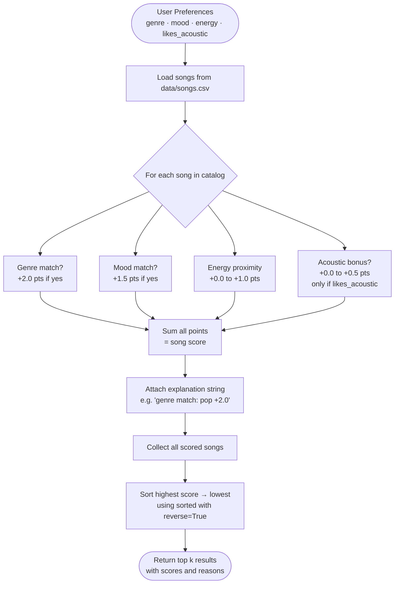

# 🎵 Music Recommender Simulation

## Project Summary

This project builds a content-based music recommender that scores songs against a user's taste profile and returns a ranked list of suggestions with plain-language explanations. It is a simplified simulation designed to mirror the logic behind real streaming platform recommendations.

---

## How The System Works

### Real-World Background

Real platforms like Spotify and YouTube combine two main approaches:

- **Collaborative filtering** — "Users like you also liked these songs." It finds patterns across millions of listening histories without needing to know anything about the song itself.
- **Content-based filtering** — "This song has the same tempo, energy, and mood as songs you've loved." It compares song attributes directly against a user's known preferences.

This simulation uses content-based filtering only, which makes it fully explainable — every score can be traced to specific song features.

### Song Features Used

Each `Song` object stores:

| Feature | Type | Description |
|---|---|---|
| `genre` | string | Musical genre (pop, lofi, rock, etc.) |
| `mood` | string | Emotional quality (happy, chill, intense, etc.) |
| `energy` | float 0–1 | How driving or intense the track feels |
| `tempo_bpm` | float | Beats per minute |
| `valence` | float 0–1 | Musical positivity |
| `danceability` | float 0–1 | How suitable for dancing |
| `acousticness` | float 0–1 | How acoustic vs electronic |

### UserProfile Fields

Each `UserProfile` stores:

- `favorite_genre` — the genre to match against
- `favorite_mood` — the mood to match against
- `target_energy` — ideal energy level (0.0–1.0)
- `likes_acoustic` — whether to bonus acoustic tracks

### Algorithm Recipe (Scoring Rules)

For each song, the system computes a score using these weighted rules:

| Rule | Points |
|---|---|
| Genre matches user's favorite_genre | +2.0 |
| Mood matches user's favorite_mood | +1.5 |
| Energy proximity: 1.0 − \|user_energy − song_energy\| | +0.0 to +1.0 |
| Acoustic bonus (if likes_acoustic): song_acousticness × 0.5 | +0.0 to +0.5 |

Genre is weighted highest because it is the strongest signal of musical taste. Mood is second. Energy is a continuous similarity score so it rewards closeness rather than just being high or low.

**Why we need both a Scoring Rule and a Ranking Rule:**
A Scoring Rule judges a single song in isolation. A Ranking Rule applies the Scoring Rule to every song in the catalog and then sorts the results. You need both — one to evaluate, one to compare.

### Data Flow



### Potential Bias Note

This system may over-prioritize genre. Because genre is worth 2.0 points — twice the mood weight — a song in the right genre will almost always rank above a song with a perfect energy match in a different genre. A dataset with more pop songs than other genres would amplify this effect.

---

## Getting Started

### Setup

1. Create a virtual environment (optional but recommended):

   ```bash
   python -m venv .venv
   source .venv/bin/activate      # Mac or Linux
   .venv\Scripts\activate         # Windows
   ```

2. Install dependencies:

   ```bash
   pip install -r requirements.txt
   ```

3. Run the app:

   ```bash
   PYTHONPATH=src python3 -m src.main
   ```

### Running Tests

```bash
python3 -m pytest tests/ -v
```

---

## Experiments You Tried

### Profile 1: High-Energy Pop Fan
`{"genre": "pop", "mood": "happy", "energy": 0.85}`

Top result: **Sunrise City** (4.47) — genre + mood + near-perfect energy match.
Surprise: **Neon Cascade** (electronic, moody) appeared at #5 purely because its energy 0.83 is close to 0.85. No genre or mood match at all — shows energy alone can sneak songs in.

### Profile 2: Chill Lofi Listener
`{"genre": "lofi", "mood": "chill", "energy": 0.38, "likes_acoustic": True}`

Top result: **Library Rain** (4.90). All four scoring categories matched. The acoustic bonus separated it from **Midnight Coding** (4.81) which had an almost identical energy match.

### Profile 3: Deep Intense Rock Head
`{"genre": "rock", "mood": "intense", "energy": 0.92}`

**Storm Runner** dominated at 4.49. The next four songs scored ~2.45–2.49 — none was rock. This shows how isolated a niche genre can be in a small catalog.

### Weight Shift Experiment
Halving genre weight from 2.0 to 1.0 shuffled the rock profile significantly — **Gym Hero** (pop, intense) jumped to #1 because its mood + energy score matched better than any other rock song. This confirmed genre weighting is the dominant factor.

---

## Limitations and Risks

- **Small catalog**: 18 songs is too few to provide real variety, especially for niche genres.
- **No collaborative signal**: The system ignores what other users with similar taste actually enjoy.
- **Vocabulary mismatch**: Mood labels are strings ("chill", "relaxed") — similar moods that use different words score zero.
- **Genre dominance**: At 2.0 points, genre is a near-decisive factor. A pop-heavy dataset would always favor pop users.
- **Static preferences**: The profile never updates based on what the user actually listens to or skips.

---

## Reflection

See [model_card.md](model_card.md) for full evaluation and reflection.

Building this showed how much of a "recommendation" is really just a weighted comparison. The surprising part was how a single score gap (Library Rain vs Midnight Coding separated by 0.09 points, purely from acousticness) mirrors the kind of micro-decisions real systems make at scale — but with millions of implicit signals instead of four explicit ones.
